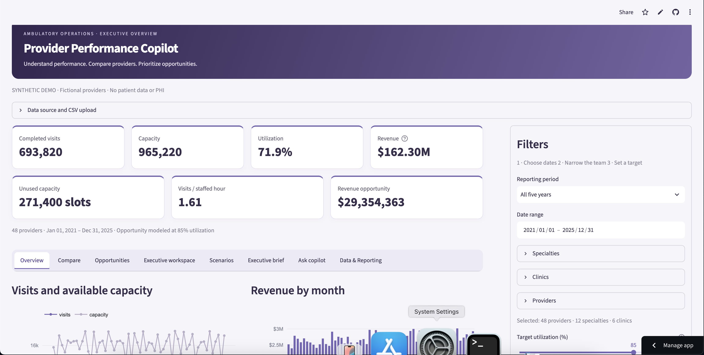

# Provider Performance Copilot

An AI-powered operational decision-support application for ambulatory healthcare organizations.

Provider Performance Copilot helps practice managers and healthcare leaders identify unused capacity, analyze provider performance, estimate revenue opportunities, compare operational trends, and investigate performance questions through a conversational Copilot.

> **Live Demo:** https://paurinshah-ship-it-provider-performance-copilot-app-ebiivb.streamlit.app/

## Product Preview



*Executive overview showing provider capacity, utilization, visits, revenue trends, and modeled revenue opportunity.*

## Why I Built This

Ambulatory healthcare organizations generate large amounts of operational data, but turning that data into actionable decisions can be difficult.

Practice leaders often need to answer questions such as:

- Which providers have the greatest opportunity to improve utilization?
- Where is unused appointment capacity concentrated?
- Which operational issues deserve investigation?
- How is performance changing over time?
- What could improved utilization mean financially?

Provider Performance Copilot is designed to turn those questions into an interactive operational workflow rather than another static dashboard.

## Product Capabilities

### Executive Overview

Provides organization-level visibility into:

- Unused appointment capacity
- Visits per staffed hour
- Estimated revenue opportunity
- Visits and available capacity
- Monthly revenue trends
- Annual performance metrics

### Provider Performance Analysis

Users can filter and analyze performance across:

- Providers
- Specialties
- Clinics
- Reporting periods
- Custom date ranges

The application calculates operational metrics from the underlying provider-day dataset rather than relying on language-model-generated numbers.

### Opportunity Detection

The application identifies operational opportunities using metrics such as:

- Utilization
- Unbooked appointment slots
- No-show rates
- Available capacity
- Provider revenue per visit
- Specialty comparisons

Revenue opportunity is modeled from unused capacity and observed provider revenue per visit. It is an estimate for operational analysis, not guaranteed revenue or profit.

### Ask Copilot

The conversational Copilot allows users to investigate the operational dataset using natural-language questions.

Example questions include:

- Which providers have the greatest opportunity to improve utilization?
- Which provider should operations investigate?
- Compare performance with the previous period.
- Estimate the revenue impact.
- Show a provider trend.
- Summarize performance.

The Copilot is designed around a **grounded analytics architecture**:

**User question → query interpretation → deterministic analytics → grounded context → conversational explanation**

This keeps calculations in the analytics layer while using AI to help interpret and communicate results.

### Analytical Memory

The application can preserve analytical context across a conversation so follow-up questions can build on previous analysis rather than behaving like isolated prompts.

### Executive Decision Support

Additional workflows support:

- Provider comparisons
- Opportunity investigation
- Executive workspace analysis
- Scenario modeling
- Executive summaries
- Data and reporting workflows

## Product Architecture

```text
PostgreSQL aggregate provider-day tables (or local synthetic CSV fallback)
        ↓
Data validation and loading
        ↓
Deterministic analytics engine
        ↓
Operational metrics and opportunity detection
        ↓
Query interpretation / analytical context
        ↓
AI Copilot
        ↓
Decision-support interface
```

The architecture intentionally separates quantitative calculations from generative AI.

The analytics layer determines the numbers. The Copilot explains and helps users investigate those numbers.

### PostgreSQL analytics boundary

Set `DATABASE_URL` to use PostgreSQL as the dashboard source of record. Run
`python scripts/load_postgres.py` once to create and load the schema from the
synthetic demo dataset. The normalized schema is in `db/schema.sql`: `specialty`,
`provider`, `appointment`, and `performance` tables hold aggregate operational
provider-day data only.

Copilot questions are converted to catalog metric keys, dimensions, dates, and
filters. The backend accepts only that allowlisted analytical representation and
compiles parameterized read-only SQL. It never executes LLM-generated SQL, and
user values are passed as bound parameters. Pandas is retained only as the
Streamlit/Plotly dataframe adapter after retrieval.

### Scale-test path

Run `python scripts/generate_appointment_events.py` to create one million
fictional appointment events without patient identifiers or clinical data. The
file is intentionally ignored by Git. For large datasets, use PostgreSQL's
`COPY` loader (`python scripts/load_appointment_events.py`) and the safe queries in `src/scalable_analytics.py`: aggregation
happens in SQL, repeat aggregate queries use bounded TTL caching, and detailed
event access uses keyset pagination rather than loading every row into Pandas.

## Technology Stack

- Python
- Streamlit
- Pandas
- Plotly
- OpenAI API
- Pytest
- Git / GitHub
- Streamlit Community Cloud

## Data Model

The demo uses synthetic ambulatory provider-performance data.

The dataset includes dimensions and measures such as:

- Date
- Provider
- Specialty
- Clinic
- FTE
- Staffed hours
- Appointment capacity
- Booked appointments
- Visits
- No-shows
- Revenue

The demonstration dataset contains fictional providers, specialties, and clinics.

**No PHI, patient identifiers, or patient-level records are used.**

## Key Metrics

### Utilization

```text
Visits / Appointment Capacity
```

### Unused Capacity

Represents appointment capacity that did not result in completed visits.

### Visits per Staffed Hour

```text
Visits / Staffed Hours
```

### Estimated Revenue Opportunity

Conceptually:

```text
max(0, target utilization × capacity − visits)
× provider revenue per visit
```

This is a scenario estimate intended to help prioritize operational investigation. It should not be interpreted as guaranteed incremental revenue.

## AI Guardrails

The Copilot is designed as an **operational analytics assistant**, not a clinical decision-support system.

It should not:

- Provide patient-specific information
- Diagnose or treat patients
- Recommend medications
- Make employment decisions
- Invent operational figures
- Replace validated source metrics with generated numbers

The application uses synthetic operational data and is intended as a product demonstration.

## Running Locally

Python 3.10+ is recommended.

```bash
python3 -m venv .venv
source .venv/bin/activate
python -m pip install -r requirements.txt
.venv/bin/python scripts/generate_appointment_events.py
streamlit run app.py
```

Then open:

```text
http://localhost:8501
```

## Testing

Run the automated test suite with:

```bash
python -m pytest -q
```

## Repository Structure

```text
app.py                  Streamlit application
src/                    Analytics and application modules
data/                   Synthetic provider-performance data
scripts/                Data generation and supporting scripts
tests/                  Automated tests
.streamlit/             Streamlit configuration
requirements.txt        Application dependencies
README.md               Project documentation
ROADMAP.md              Product roadmap
```

## Deployment

The application is deployed publicly using Streamlit Community Cloud and connected to this GitHub repository.

Changes pushed to the deployment branch can be reflected in the hosted application through the Streamlit deployment workflow.

API credentials and other secrets are stored through Streamlit Secrets and are not committed to the repository.

## Product Philosophy

Provider Performance Copilot is built around a simple principle:

> **AI should explain and accelerate operational analysis — not invent the underlying facts.**

The product combines deterministic analytics with conversational AI so healthcare operators can move from:

**data → insight → investigation → decision**

within a single workflow.

## Current Status

This is an actively developed portfolio product demonstrating:

- AI product management
- Healthcare operations analytics
- Conversational analytics
- Product architecture
- AI guardrails
- Data visualization
- Scenario modeling
- Executive decision support
- Cloud deployment

Future iterations may expand data ingestion, enterprise integrations, authentication, governance, and additional operational workflows.

## Disclaimer

Provider Performance Copilot is a demonstration product using synthetic data.

It is not intended for clinical decision-making, patient care, employment decisions, financial forecasting, or production healthcare use without appropriate validation, security, governance, and compliance controls.
