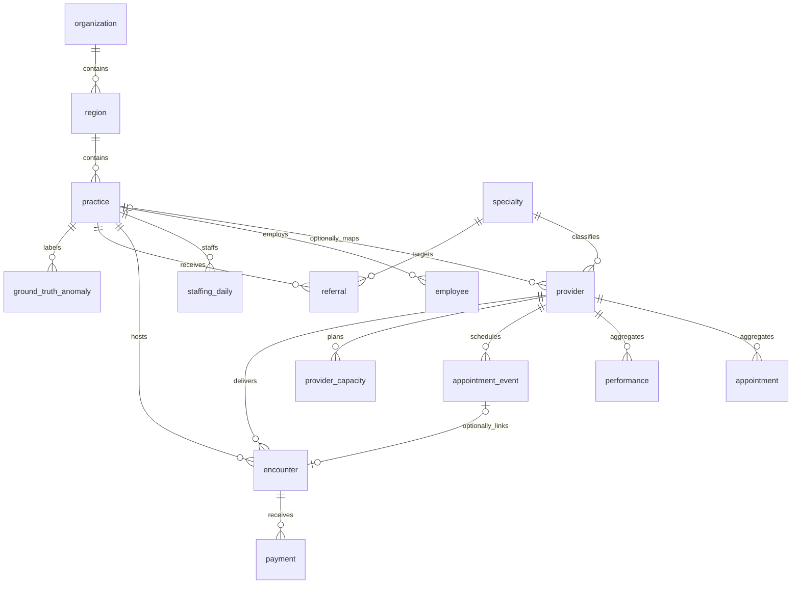

# OpPilot AI enterprise data model — Phase 1A

**Autonomous Healthcare Operations Intelligence**

An empty PostgreSQL foundation for future operational capabilities. Existing
Streamlit UI, CSV contract, deterministic analytics, semantic allowlists, AI
guardrails, scenarios and audit behavior are unchanged. This phase adds no
agents, jobs, enterprise generator or new analytics.

## Hierarchy and table responsibilities

Organization → Region → Practice → Provider. Each region belongs to one
organization and each practice to one region. Providers may remain unmapped.
Organization names are unique; region codes are unique within an organization,
and practice codes within a region. Codes are case-sensitive. New generated IDs
use BIGSERIAL; existing provider IDs remain TEXT, including `SYN-001`.

| Table | Grain and responsibility |
| --- | --- |
| `organization` | Organization identity and timezone-aware creation timestamp. |
| `region` | Organization-owned region and scoped code. |
| `practice` | Region-owned practice, fictional city/state, type, opening date and active flag. |
| `employee` | Fictional employee ID, practice, role, FTE, cost and employment dates/status; no personal identity fields. |
| `provider_capacity` | Provider/day scheduled and clinical hours, available/blocked slots, PTO and administrative hours. |
| `staffing_daily` | Practice/day/role budgeted, scheduled and actual FTE, overtime, agency and absence hours. |
| `encounter` | Synthetic service record with provider/practice, date, visit type, RVUs, modeled charge and allowed amount. Optional unique appointment-event link permits walk-ins. |
| `referral` | Synthetic practice/specialty referral with referral/scheduled dates, source category and status. |
| `payment` | Synthetic payment component record for an encounter/date/payer category; multiple payments per encounter allowed. |
| `ground_truth_anomaly` | Future generator-injected anomaly labels: practice, interval, type, metric, direction, severity and synthetic explanation. |

## Existing Provider Performance tables

| Table | Preserved contract |
| --- | --- |
| `specialty` | BIGSERIAL ID and unique name; unchanged. |
| `provider` | TEXT `provider_id`, name, specialty FK, required `clinic_name`, name/clinic uniqueness; only nullable `practice_id` added. |
| `appointment` | Provider/date aggregates: capacity, bookings, no-shows; unchanged. |
| `performance` | Provider/date aggregates: FTE, staffed hours, visits, realized revenue; unchanged. |
| `appointment_event` | Optional scale fixture with appointment ID, provider/date, status and modeled revenue; columns, constraints and indexes unchanged. |

The dashboard still joins appointment and performance by provider/date, then
provider and specialty. Clinics still use `provider.clinic_name`. Existing
loaders name columns explicitly and work without practice mappings. Provider IDs
are never renamed or regenerated. Nullable `practice_id` avoids forcing a
hierarchy backfill; clinic names alone cannot determine region/organization.
Existing benchmark labels still represent clinic and selected-provider scopes,
not this new hierarchy. New tables do not automatically enable new metrics.



## Integrity and indexes

Required relationships use NOT NULL and foreign keys. Optional relationships are
provider→practice and encounter→appointment_event. Default NO ACTION deletes
protect dependent facts; nothing cascades. Composite primary keys enforce daily
capacity and staffing grains. An event links to at most one encounter. Encounter
provider/practice identify service scope and need not equal the originally
scheduled provider or a provider's current practice. Future loaders must define
reassignment and historical membership policies explicitly.

New operational FTE, hours, slots, RVUs and monetary components are nonnegative;
zero is valid. Numeric NaN is rejected; fixed precision excludes infinity.
Legacy positive-value rules remain intact. No assumptions force hours to be
disjoint/additive or aggregate staffing FTE to be at most one.

Termination cannot precede hire. Employee statuses: `active`, `on_leave`,
`terminated`; only terminated employees have a termination date. Referral
statuses: `pending`, `scheduled`, `completed`, `cancelled`, `declined`.
Scheduled/completed referrals require a scheduled date; that date cannot precede
referral. Anomaly intervals allow equal start/end but cannot run backward.
Directions: `increase`, `decrease`; severities: `low`, `medium`, `high`.

Unique indexes already cover region-by-organization and practice-by-region.
Composite primary keys cover capacity by provider/date and staffing by
practice/date. Additional indexes cover providers/employees by practice,
encounters by practice/date and provider/date, referrals by practice/date and
specialty, payments by encounter/date, and anomalies by practice/start/end.
The anomaly B-tree filters by practice/start then end; it is not a specialized
interval-overlap index.

## Appointment statuses: compatibility boundary

Supported now: `completed`, `no_show`, legacy `cancelled`.
Planned: `cancelled_patient`, `cancelled_provider`, `cancelled_practice`,
`rescheduled`, alongside all three existing statuses.
**Richer statuses remain rejected in Phase 1A.**

The current event no-show rate excludes only `cancelled` from its denominator.
Expanding its CHECK alone would count the new cancellations/reschedules as
eligible bookings and silently change analytics. A future migration must first
define reschedule semantics, update event formulas/tests, and transactionally
replace `appointment_event_appointment_status_check`. Merely changing CREATE
TABLE IF NOT EXISTS would not upgrade that constraint on existing databases.
The current generator and COPY loader remain untouched; no new million-row
fixture is generated.

## Why appointments and encounters are separate

`appointment` is a daily aggregate, not a scheduling event. `appointment_event`
includes outcomes such as no-shows/cancellations without a completed service.
Therefore `encounter.appointment_id` references the event table, not the daily
aggregate. Walk-in encounters may lack a scheduling link. No aggregate is
recalculated from encounters in this phase.

## Why revenue and payments are separate

`performance.realized_revenue` stays the existing synthetic revenue measure.
Modeled charges, allowed amounts and later payment components are different
concepts; multiple payments may belong to one encounter. Payment allowed amounts
are record-level components, not amounts to blindly sum with encounter-level
allowed amounts. `patient_amount` is a synthetic financial component without a
patient identifier. Nonnegative payments are not a signed refund/reversal ledger.
No cross-table reconciliation is implied. Revenue never substitutes for
collections; the semantic catalog still marks collections unavailable.

Ground-truth anomalies preserve known future simulation conditions so detection
can later be evaluated. They are not detected alerts, causal conclusions, an
audit-log replacement or material for current AI responses. No generation or
detection behavior is added.

## Synthetic-data policy

All rows must be fictional operational demonstration data. No patient names,
street addresses, phone numbers, emails, SSNs, real patient identifiers,
diagnoses, medications, clinical notes or PHI are permitted. City/state describe
fictional practices. Role, visit type, source, payer category and description
must contain synthetic operational labels, never personal or clinical narratives.
SQL types cannot certify free text as non-PHI; future ingestion must enforce
this policy. No patient entity or relationship is introduced.

## Application and migration risks

`db/schema.sql` is the canonical definition. Existing
`PostgresRepository.initialize_schema()` executes it in a transaction. CREATE
IF NOT EXISTS creates missing tables; additive ALTER adds nullable practice_id
to legacy providers. Reapplication preserves existing rows and mappings. New
tables start empty. For a schema-only deployment to a reviewed target:

```sh
psql "$DATABASE_URL" -v ON_ERROR_STOP=1 --single-transaction -f db/schema.sql
```

The existing loader also upserts demo data; do not use it just to deploy DDL.
This development change does not apply DDL to any application database. Deployment
needs table/sequence creation and provider ALTER privileges. Take a backup and
schedule a maintenance window: ALTER and foreign-key creation take locks.
Transaction failure rolls back additions. No destructive down migration is
provided; after new tables have data, rollback requires a data-retention plan.

IF NOT EXISTS supports the known legacy schema, not arbitrary drift. Existing
same-named tables/columns with different definitions require review before
application. Nullable practice_id does not establish clinic/practice consistency;
that mapping is a future task. Deployment architecture stays unchanged.

## Validation

Use a disposable PostgreSQL database for integration tests:

```sh
OPPILOT_TEST_DATABASE_URL=postgresql://localhost/oppilot_test python -m pytest -q tests/test_enterprise_schema.py
python -m pytest -q
```

Tests create randomly named schemas and roll back all changes, including those
schemas. They never read DATABASE_URL. Without OPPILOT_TEST_DATABASE_URL, static
column/table checks run while PostgreSQL cases explicitly skip. Full validation
requires setting the test URL to exercise real constraint rejection, legacy
upgrade, repeatability, indexes, foreign keys, dates and statuses. Existing
psycopg is sufficient; no new production dependency is required.
