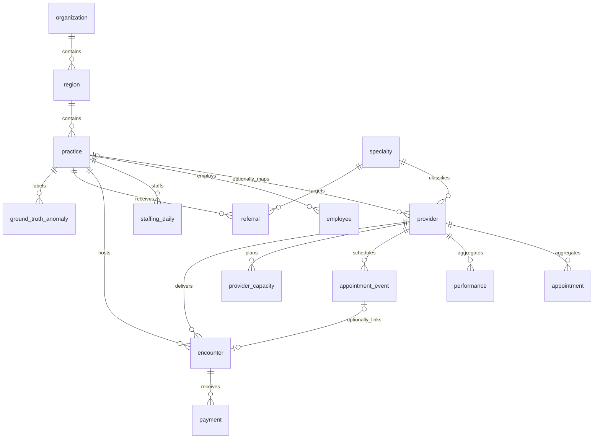

# OpPilot AI enterprise data model — Phases 1A–1D

**Autonomous Healthcare Operations Intelligence**

Phase 1A established the PostgreSQL foundation. Phase 1B adds deterministic
synthetic reference generation and an explicit transactional loader. Phase 1C
adds an independent employee/capacity/staffing baseline and bulk loader. Existing
Streamlit UI, CSV contract, deterministic analytics, semantic allowlists, AI
guardrails, scenarios and audit behavior are unchanged. No agents, jobs,
new analytics or frontend integration are added. Phase 1D adds a synthetic,
event-grain scheduling fixture and a bulk loader; it does not change dashboard
queries or existing Provider Performance calculations.

## Hierarchy and table responsibilities

Organization → Region → Practice → Provider. Each region belongs to one
organization and each practice to one region. Providers may remain unmapped.
Organization names are unique; region codes are unique within an organization,
and practice codes within a region. Codes are case-sensitive. New generated IDs
use BIGSERIAL; existing provider IDs remain TEXT, including `SYN-001`.

| Table | Grain and responsibility |
| --- | --- |
| `organization` | Organization identity and timezone-aware creation timestamp. |
| `region` | Organization-owned region and scoped code. |
| `practice` | Region-owned practice, fictional city/state, type, opening date and active flag. |
| `employee` | Fictional employee ID, practice, role, FTE, cost and employment dates/status; no personal identity fields. |
| `provider_capacity` | Provider/day scheduled and clinical hours, available/blocked slots, PTO and administrative hours. |
| `staffing_daily` | Practice/day/role budgeted, scheduled and actual FTE, overtime, agency and absence hours. |
| `encounter` | Synthetic service record with provider/practice, date, visit type, RVUs, modeled charge and allowed amount. Optional unique appointment-event link permits walk-ins. |
| `referral` | Synthetic practice/specialty referral with referral/scheduled dates, source category and status. |
| `payment` | Synthetic payment component record for an encounter/date/payer category; multiple payments per encounter allowed. |
| `ground_truth_anomaly` | Future generator-injected anomaly labels: practice, interval, type, metric, direction, severity and synthetic explanation. |

## Existing Provider Performance tables

| Table | Preserved contract |
| --- | --- |
| `specialty` | BIGSERIAL ID and unique name; unchanged. |
| `provider` | TEXT `provider_id`, name, specialty FK, required `clinic_name`, name/clinic uniqueness; only nullable `practice_id` added. |
| `appointment` | Provider/date aggregates: capacity, bookings, no-shows; unchanged. |
| `performance` | Provider/date aggregates: FTE, staffed hours, visits, realized revenue; unchanged. |
| `appointment_event` | Optional event-grain fixture with the five legacy fields plus nullable practice, visit-type, booking-time, duration and payer fields. Expanded status constraint supports the Phase 1D catalog. |

The dashboard still joins appointment and performance by provider/date, then
provider and specialty. Clinics still use `provider.clinic_name`. Existing
loaders name columns explicitly and work without practice mappings. Provider IDs
are never renamed or regenerated. Nullable `practice_id` avoids forcing a
hierarchy backfill; clinic names alone cannot determine region/organization.
Existing benchmark labels still represent clinic and selected-provider scopes,
not this new hierarchy. New tables do not automatically enable new metrics.



## Integrity and indexes

Required relationships use NOT NULL and foreign keys. Optional relationships are
provider→practice and encounter→appointment_event. Default NO ACTION deletes
protect dependent facts; nothing cascades. Composite primary keys enforce daily
capacity and staffing grains. An event links to at most one encounter. Encounter
provider/practice identify service scope and need not equal the originally
scheduled provider or a provider's current practice. Future loaders must define
reassignment and historical membership policies explicitly.

New operational FTE, hours, slots, RVUs and monetary components are nonnegative;
zero is valid. Numeric NaN is rejected; fixed precision excludes infinity.
Legacy positive-value rules remain intact. No assumptions force hours to be
disjoint/additive or aggregate staffing FTE to be at most one.

Termination cannot precede hire. Employee statuses: `active`, `on_leave`,
`terminated`; only terminated employees have a termination date. Referral
statuses: `pending`, `scheduled`, `completed`, `cancelled`, `declined`.
Scheduled/completed referrals require a scheduled date; that date cannot precede
referral. Anomaly intervals allow equal start/end but cannot run backward.
Directions: `increase`, `decrease`; severities: `low`, `medium`, `high`.

Unique indexes already cover region-by-organization and practice-by-region.
Composite primary keys cover capacity by provider/date and staffing by
practice/date. Additional indexes cover providers/employees by practice,
encounters by practice/date and provider/date, referrals by practice/date and
specialty, payments by encounter/date, and anomalies by practice/start/end.
The anomaly B-tree filters by practice/start then end; it is not a specialized
interval-overlap index.

## Appointment events and status compatibility

`appointment_event` preserves the original five fields and their order:
`appointment_id`, `provider_id`, `appointment_date`, `appointment_status`, and
`modeled_revenue`. Phase 1D appends nullable `practice_id`, `appointment_type`,
`scheduled_at`, `slot_duration_minutes`, and `payer_category`. Null additions
keep legacy inserts and the original five-column scale loader valid. The event
ID range begins above the existing 1–1,000,000 legacy scale-generator range.

The status constraint accepts `completed`, `no_show`, `cancelled`,
`cancelled_patient`, `cancelled_provider`, `cancelled_practice`, and
`rescheduled`. Legacy `cancelled` remains valid. The enterprise fixture divides
the old 11% cancellation share among the four explicit cancellation/reschedule
labels; the baseline weights remain 78% completed, 11% no-show, and 11% total
cancellation/reschedule. These are synthetic assumptions, not measured rates.

The scalable event-level no-show calculation uses visit outcomes as the
denominator:

```sql
COUNT(*) FILTER (WHERE appointment_status = 'no_show')::numeric /
NULLIF(COUNT(*) FILTER (
  WHERE appointment_status IN ('completed', 'no_show')
), 0)
```

Therefore `cancelled`, `cancelled_patient`, `cancelled_provider`,
`cancelled_practice`, and `rescheduled` are excluded from the denominator. For
legacy event data containing only `completed`, `no_show`, and `cancelled`, this
produces the same result as the earlier `appointment_status <> 'cancelled'`
expression. The dashboard's provider-day no-show and utilization calculations
remain unchanged. The schema initializer transactionally replaces the old status
CHECK because `CREATE TABLE IF NOT EXISTS` alone would leave existing
installations with the three-status constraint.

Appointment types are operational labels (`new_patient`, `follow_up`, `annual`,
`procedure`, `consult`, `urgent`, `telehealth`) with specialty-specific weights.
Payer categories are synthetic (`Commercial`, `Medicare`, `Medicaid`, `Self
Pay`, `Other`). Scheduled timestamps use UTC and precede service date; urgent
appointments have short lead times, follow-ups moderate lead times, and
consults longer lead times. Slot durations are positive 15, 20, 30, 45, or 60
minutes and are weighted by appointment type. Modeled revenue is nonnegative
and appears only on completed events; it is not collections.

Generation is deterministic for a fixed seed and streams up to one million
events without holding them all in memory. The PostgreSQL loader COPYs to a
temporary staging table, validates reference/provider-practice integrity,
rejects conflicting existing IDs, and inserts missing rows in one transaction.
Matching reruns are idempotent. It touches only `appointment_event`; encounter,
payment, referral and anomaly generation are not part of this phase.

## Why appointments and encounters are separate

`appointment` is a daily aggregate, not a scheduling event. `appointment_event`
includes outcomes such as no-shows/cancellations without a completed service.
Therefore `encounter.appointment_id` references the event table, not the daily
aggregate. Walk-in encounters may lack a scheduling link. No aggregate is
recalculated from encounters in this phase.

## Why revenue and payments are separate

`performance.realized_revenue` stays the existing synthetic revenue measure.
Modeled charges, allowed amounts and later payment components are different
concepts; multiple payments may belong to one encounter. Payment allowed amounts
are record-level components, not amounts to blindly sum with encounter-level
allowed amounts. `patient_amount` is a synthetic financial component without a
patient identifier. Nonnegative payments are not a signed refund/reversal ledger.
No cross-table reconciliation is implied. Revenue never substitutes for
collections; the semantic catalog still marks collections unavailable.

Ground-truth anomalies preserve known future simulation conditions so detection
can later be evaluated. They are not detected alerts, causal conclusions, an
audit-log replacement or material for current AI responses. No generation or
detection behavior is added.

## Synthetic-data policy

All rows must be fictional operational demonstration data. No patient names,
street addresses, phone numbers, emails, SSNs, real patient identifiers,
diagnoses, medications, clinical notes or PHI are permitted. City/state describe
fictional practices. Role, visit type, source, payer category and description
must contain synthetic operational labels, never personal or clinical narratives.
SQL types cannot certify free text as non-PHI; future ingestion must enforce
this policy. No patient entity or relationship is introduced.

## Application and migration risks

`db/schema.sql` is the canonical definition. Existing
`PostgresRepository.initialize_schema()` executes it in a transaction. CREATE
IF NOT EXISTS creates missing tables; additive ALTER adds nullable practice_id
to legacy providers. Reapplication preserves existing rows and mappings. New
tables start empty. For a schema-only deployment to a reviewed target:

```sh
psql "$DATABASE_URL" -v ON_ERROR_STOP=1 --single-transaction -f db/schema.sql
```

The existing loader also upserts demo data; do not use it just to deploy DDL.
This development change does not apply DDL to any application database. Deployment
needs table/sequence creation and provider ALTER privileges. Take a backup and
schedule a maintenance window: ALTER and foreign-key creation take locks.
Transaction failure rolls back additions. No destructive down migration is
provided; after new tables have data, rollback requires a data-retention plan.

IF NOT EXISTS supports the known legacy schema, not arbitrary drift. Existing
same-named tables/columns with different definitions require review before
application. Nullable practice_id does not establish clinic/practice consistency;
that mapping is a future task. Deployment architecture stays unchanged.

## Validation

Use a disposable PostgreSQL database for integration tests:

```sh
OPPILOT_TEST_DATABASE_URL=postgresql://localhost/oppilot_test python -m pytest -q tests/test_enterprise_schema.py
python -m pytest -q
```

Tests create randomly named schemas and roll back all changes, including those
schemas. They never read DATABASE_URL. Without OPPILOT_TEST_DATABASE_URL, static
column/table checks run while PostgreSQL cases explicitly skip. Full validation
requires setting the test URL to exercise real constraint rejection, legacy
upgrade, repeatability, indexes, foreign keys, dates and statuses. Existing
psycopg is sufficient; no new production dependency is required.


## Phase 1B synthetic reference fixture

The entirely fictional **NorthStar Medical Group** has five regions and five
practices per region (25 total): Northeast (R01), Mid-Atlantic (R02), Southeast
(R03), Midwest (R04), Southwest (R05). Practices use real U.S. city/state geography
with invented names and no real organization affiliations. Region and practice
IDs are explicit stable integers starting at 10001; practice codes are P01–P25.

Exactly 150 fictional providers are generated. The shared legacy identity helper
in `src/data.py` preserves SYN-001–SYN-048 and their names, specialties and exact
clinic labels. North, Central, South, East, West and Lakeside Clinic map explicitly
to P01, P06, P11, P07, P21 and P16 respectively. Each label is also that practice's
name. New SYN-049–SYN-150 providers use their practice name as clinic_name.
Seed 42 controls fictional name selection and opening dates; no clock or database
state affects generated output. All practices receive providers, with specialty
assignments aligned to practice type.

The original catalog has 12 specialties. All are retained for compatibility;
new providers use ten of them. Exported specialty IDs follow alphabetical order,
while loading resolves existing specialty IDs by name and preserves those IDs.
Conflicting hierarchy/provider identities abort the transaction. Matching legacy
providers may have their NULL practice_id filled; no other provider values are
overwritten. Schema nullability itself remains unchanged.

The reference loader inserts only organization, region, practice, specialty and
provider records, advances their serial sequences transactionally when necessary,
and never writes operational tables. No newly generated reference provider is
presented as having measured performance. Existing dashboard joins, clinic
filters, provider-day CSV and appointment-event behavior remain unchanged.

See [Synthetic enterprise reference data](../data/synthetic-enterprise-data.md)
for distribution, fixed IDs, commands, collision handling, loader permissions,
sequence behavior and validation instructions. These commands are explicit
operator actions, not part of Streamlit startup or background processing.


## Phase 1C operational baseline

The new operations generator reuses Phase 1B references and populates only
employee, provider_capacity and staffing_daily. It creates 462 nameless fictional
employees across eight approved operational roles, 109,650 provider/day capacity
rows and 146,200 practice/day/role staffing rows. Daily coverage is 2024-01-01
through 2025-12-31 inclusive (731 days). This dataset is independent of the legacy
2021–2025 provider-day facts, whose generator, dates and analytics stay unchanged.

MA headcount scales with provider count; larger practices have additional RNs
and billing staff. Employees are an active fixed cohort with realistic synthetic
FTE/cost ranges and hires after practice opening but before the window. No
personal fields are generated. Provider profiles vary by specialty and provider;
scheduled hours include clinical, administrative and PTO hours without overlap.
Daily staffing derives from roster FTE, routine planned leave and unplanned
absences. Overtime/agency replace only part of uncovered budget hours and remain
separate from actual regular-staff FTE. Weekends are represented by zeros.

Seed 42 with stable entity/date random streams makes repeated and sliced runs
consistent. No ground-truth anomalies or persistent shortage episodes are
injected. Routine PTO/absence variation is part of the clean baseline. There are
no encounters, referrals, payments or new appointment events in this phase.

The explicit loader checks stored reference mappings, bulk-copies into temporary
staging tables and inserts missing keys in one transaction. Identical keys are
reused; conflicting values abort all writes. No existing operational rows are
overwritten. The employee sequence advances transactionally when necessary.
Reference and target locks protect loading; no schema change or application
startup hook is introduced. New tables are not connected to current dashboards.

See the [Phase 1C operational assumptions and commands](../data/synthetic-enterprise-data.md#phase-1c-independent-operational-baseline)
for role counts, equations, sampling assumptions, date-window options, loading
permissions, conflict handling and validation.
